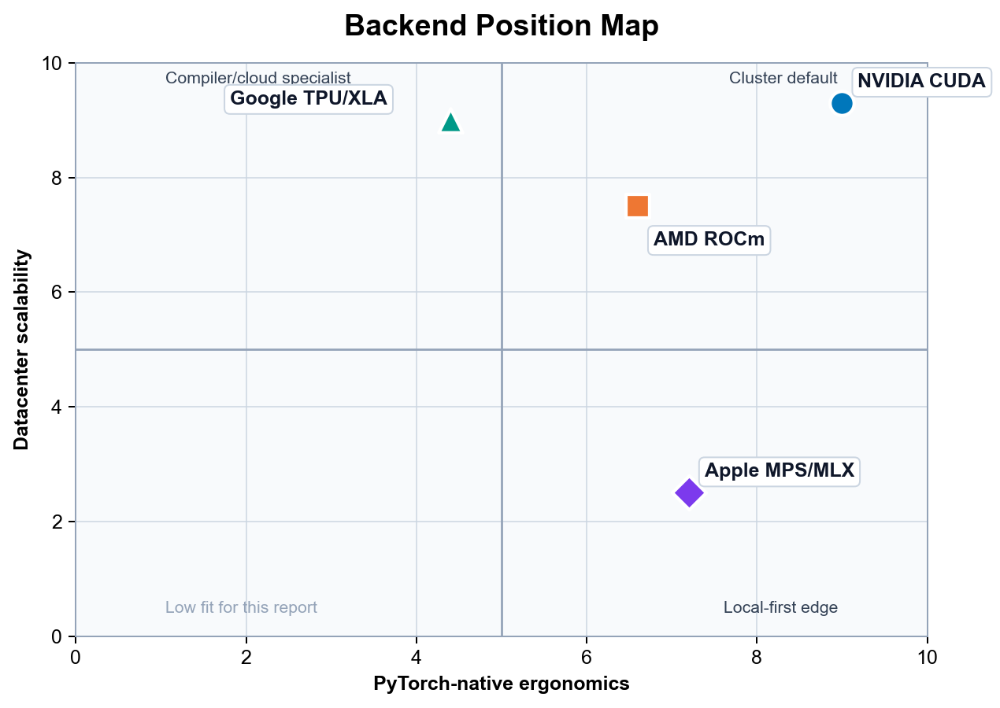

# State of PyTorch Hardware Acceleration: May 2026

## Executive Summary

PyTorch in 2026 is functionally a multi-backend platform, but operationally it is still CUDA-first. The right way to read this report is not as a tie among four equals; it is as a CUDA baseline with three meaningful alternatives, each of which earns its place under specific operating conditions. CUDA remains the safest cluster default and the only path where the compiler-and-profiler loop — TorchInductor with CUTLASS and CuTeDSL backends, FlashAttention-4, NCCL collectives, and Nsight — is complete end-to-end. ROCm has become a credible deliberate adoption target in curated MI300X- or MI325X-class environments. TPU remains powerful for XLA-friendly workloads at pod scale, with the caveat that PyTorch/XLA is still the production bridge. Apple Silicon is the strongest local prototyping platform available and is not a datacenter answer.

The headline recommendation carries forward from the 2025 report: standardize on PyTorch as the common code surface, treat CUDA as cluster truth, use Apple Silicon as the local prototyping edge, and bring ROCm or TPU into the stack only when the operating model — curated images, version pinning, XLA discipline — is deliberate rather than incidental. What is new in 2026 is that all three non-CUDA alternatives have crossed the line from "emerging" to "usable under clear conditions." The remaining differentiation is no longer feasibility; it is operational discipline.

## Method and Evidence Base

Version **0.2** makes the report's method and evidence base explicit. The substantive scope remains the public PyTorch hardware-acceleration landscape as of **May 15, 2026**; the source audit for this version was performed on **May 16, 2026**.

The source hierarchy is: official PyTorch release notes, blogs, and documentation first; vendor hardware, product, pricing, and installation pages second; official project repositories and issue trackers third; and the previous report plus the user-provided `PyTorch Hardware in May 2026.pdf` as continuity and prior-synthesis material. GitHub issues are treated as evidence of maturity, maintenance direction, and failure modes, not as authoritative hardware specifications. [^50] [^51] [^52] [^53] [^57] [^59] [^60] [^62]

The inclusion boundary is public, current documentation for CUDA, ROCm, TPU/XLA, MPS, and related local Apple inference workflows. This version excludes private benchmarks, procurement-specific pricing, undisclosed cloud discounts, and undocumented roadmap claims. When a vendor claim is retained, the report treats it as vendor-stated evidence rather than an independently reproduced benchmark.

The ratings are ordinal expert assessments, not measured benchmark scores. **High**, **Medium**, and **Low** are not equal-interval numeric values; they summarize how dependable each backend appears for a senior PyTorch team after accounting for documentation, installation path, compiler maturity, kernel availability, profiling support, and operational friction.

## What Changed Since 2025

The 2025 predecessor already argued that PyTorch hardware acceleration had become a heterogeneous, compiler-shaped landscape rather than a simple CUDA-only story. The 2026 update changes the emphasis from **"alternatives are emerging"** to **"alternatives are usable, but only under clearer operating conditions."** [^64]

| Area | 2025 framing | May 2026 update |
| --- | --- | --- |
| CUDA | CUDA/H100/Blackwell remained the operational baseline. | CUDA is still the default cluster reference, but the reason is now broader than raw hardware: upstream FlashAttention-4, CuTeDSL/GEMM work, expanded graph capture, and Nsight visibility into compiled graphs make the compiler-and-profiler loop unusually complete. |
| ROCm | ROCm was improving quickly but still felt like a Triton/CK parity project. | ROCm has become a credible deliberate adoption target, especially in curated MI300X/MI325X-class environments; the remaining caveat is operational discipline rather than basic feasibility. |
| TPU/XLA | TPU was powerful but visibly XLA-shaped, with graph-break and recompilation friction. | TPU remains powerful and cloud-economically interesting, but PyTorch/XLA is still a bridge; the TorchTPU roadmap and TPU7x/Ironwood documentation make the transition state more explicit. |
| Apple Silicon | Apple was already the local high-memory prototyping story, but not a datacenter training story. | Apple's local case is stronger because of larger unified-memory systems, MPS operator/startup improvements, and MLX momentum; the gap is still compiled PyTorch performance and datacenter scalability. |
| Recommendation | Use CUDA as the safest cluster default, with alternatives for specific workloads. | Standardize on PyTorch as the common code surface, CUDA as cluster truth, Apple as local prototyping edge, and add ROCm/TPU only when their operating models are intentional. |

## Executive Decision Matrix

The matrix below is a synthesis of upstream PyTorch 2.8 — 2.12 release notes, vendor installation guidance, backend-specific compiler documentation, and current issue trackers. The ratings are intentionally practical. "Maturity" means "how often a senior engineer can stay inside normal PyTorch habits without being surprised." "Cost efficiency" includes software friction and team time, not just silicon list price. Apple scores high there only for **local workstations and local inference**, not because it competes with datacenter accelerators on throughput. TPU scores high there only when the workload shape matches the TPU/XLA model and the team is comfortable living inside Google's operational model. [^4]

| Platform | Maturity | `torch.compile` Stability | Kernel Availability | Debugging Ease | Cost Efficiency |
| --- | --- | --- | --- | --- | --- |
| Nvidia CUDA | High | High | High | High | Medium |
| AMD ROCm | Medium | Medium | Medium | Medium | Medium |
| Google TPU | Medium | Medium | Medium | Medium | High |
| Apple Silicon MPS | Medium | Low | Low | Medium | High |

The rubric behind those labels is:

| Area | High | Medium | Low |
| --- | --- | --- | --- |
| Maturity | Ordinary PyTorch usage works with few backend-specific surprises. | Works, but backend discipline is still needed. | Frequent unsupported, prototype, or backend-specific behavior. |
| `torch.compile` Stability | Production-capable with mature graph capture, codegen, and profiling. | Works for selected workloads with caveats and version constraints. | Early, prototype, or prone to fallback and failure. |
| Kernel Availability | Deep fused attention, quantization, and custom-kernel ecosystem. | Core kernels exist but are environment- or workload-specific. | Limited native fused-kernel ecosystem. |
| Debugging Ease | First-party profiler with strong PyTorch integration. | Usable profiling, but less integrated or less routine. | Sparse, indirect, or immature tooling. |
| Cost Efficiency | Strong throughput-per-dollar or local utility after operational costs. | Compelling in specific workload and operational conditions. | Software friction often offsets hardware economics. |

Confidence and volatility are tracked separately from the ratings:

| Topic | Confidence | Volatility | Recheck trigger |
| --- | --- | --- | --- |
| CUDA compiler and kernel stack | High | Medium | Each PyTorch, NVIDIA CUDA, or Nsight release. |
| ROCm compile and container story | Medium-high | High | Each ROCm, AMD container, or PyTorch release. |
| TPU PyTorch/XLA and TorchTPU roadmap | Medium | High | TorchTPU public release or a new TPU software matrix. |
| MPS compile and low-bit inference | Medium | High | PyTorch MPS compile tracker, Metal release, or TorchAO Apple-kernel change. |
| Apple local-memory advantage | High | Medium | Apple hardware refresh or spec change. |

Here, **confidence** means confidence in the public evidence trail, while **volatility** means the likelihood that the assessment changes within one or two release cycles.

The workload-specific reading of the same evidence is:

| Workload | Default recommendation | Strong alternatives | Avoid or qualify |
| --- | --- | --- | --- |
| Frontier training | CUDA cluster | TPU for Google Cloud/XLA-native teams; ROCm for AMD-owned platforms | Apple MPS; ad hoc ROCm environments |
| Fine-tuning | CUDA for repeatable throughput and tooling | ROCm in curated containers; TPU for static XLA-friendly pipelines; Apple for small local jobs | Treating local MPS results as cluster performance evidence |
| Batch inference | CUDA when latency, kernel choice, and profiling matter | ROCm on memory-heavy AMD nodes; TPU for Google Cloud batch serving | Assuming one low-bit stack transfers cleanly across backends |
| Local LLM inference | Apple Silicon with MLX or eager PyTorch MPS, depending on portability needs | CUDA workstations; ROCm workstations where supported | TPU; MPS `torch.compile` as a performance proxy |
| Research prototyping | Apple laptop plus CUDA validation cluster | ROCm if it is the intended deployment target; TPU if XLA is part of the research question | Backend-specific kernels before correctness is portable |

This second matrix separates **training**, **inference**, and **local experimentation** more explicitly than the headline decision matrix. It does not overturn the main recommendation; it explains why a team can rationally use Apple locally, CUDA as the cluster reference, ROCm as an intentional second cluster target, and TPU as a specialized cloud target at the same time.

If the question is **"what should be the default PyTorch cluster standard?"**, the answer is still **CUDA**. PyTorch 2.7 added Blackwell support, PyTorch 2.11 added an upstream FlashAttention-4 backend for FlexAttention on Hopper and Blackwell, and PyTorch 2.12 continued to expand CUDA-first compiler and graph features. Nsight Systems 2026.2 now even annotates optimized graphs generated by `torch.compile`, which is exactly the kind of tooling convergence that turns a compiler feature into a dependable production tool rather than a benchmark trick. [^5] [^50] [^51] [^37]

If the question is **"what is the most interesting alternative?"**, ROCm now deserves a serious seat at the table.

PyTorch 2.8 added functional support for the new `gfx950` architecture on ROCm 7 with max-autotune coverage in TorchInductor and the Composable Kernel backend; ROCm documentation now treats Triton and CK as first-class optimization tools; and AMD's current `primus` training images ship with a modern stack that includes PyTorch, Triton, FlashAttention 2.8.3, Transformer Engine 2.8, hipBLASLt, and RCCL. But AMD's own docs still recommend Docker as the preferred installation path specifically to avoid environment issues, which tells you that ROCm's software story is improving faster than its "boring install" story. [^6] [^62] [^63]

If the question is **"what wins on cloud economics when the workload is XLA-friendly?"**, TPU is still formidable.

Google publishes per-chip-hour pricing for TPU v5p, Trillium, and Ironwood on its Cloud TPU pricing page; rates vary by region and commitment, and committed-use discounts substantially reduce on-demand rates. Google's eighth-generation TPU announcement — TPU 8t for training and TPU 8i for inference, the successors to the v7 Ironwood family — is more specific about system claims: TPU 8t is described as delivering nearly **3×** compute performance per pod over the previous generation, while TPU 8t and 8i are described as delivering up to **2×** better performance per watt over Ironwood. The catch is that PyTorch on TPU still lives behind PyTorch/XLA and XLA-native constraints, rather than feeling like a normal accelerator backend in the way CUDA does. [^7] [^53] [^54] [^55]

If the question is **"what is the fairest answer for local prototyping?"**, Apple deserves more respect than datacenter-biased analyses usually give it. Apple's current public Mac lineup relevant to this discussion is unusually strong on memory capacity: Mac Studio currently ships with **M4 Max or M3 Ultra**, M3 Ultra scales to **512GB unified memory**, and Apple explicitly positions it for extremely large local AI workloads; meanwhile the current MacBook Pro line includes **M5 Max** systems with up to **128GB unified memory**. PyTorch 2.12 also moved all MPS tensors to unified memory unconditionally, which narrows the conceptual gap between PyTorch MPS and frameworks like MLX that were designed around Apple's shared-memory model from the start. What Apple still does not have is a production-grade PyTorch compiler stack equivalent to CUDA. [^8] [^50] [^57] [^58]

## Ergonomics and Scalability Map

The map compresses the report's main thesis into two axes: PyTorch-native ergonomics (how naturally the platform behaves like a normal PyTorch backend, including torch.compile, eager debugging, profiler support, and kernel ecosystem) and datacenter scalability (how cleanly the platform extends from a single accelerator to multi-node training at frontier-model scale).

CUDA sits high on both. The PyTorch-on-CUDA stack remains the most complete: TorchInductor with the CUTLASS and CuTeDSL backends, FlashAttention-4 on Hopper and Blackwell, mature NCCL collectives, Nsight visibility into compiled graphs, and a kernel ecosystem that absorbs new research within weeks. Scale-up via NVLink and scale-out via InfiniBand are both well-understood operationally. There is no other platform where the path from a laptop prototype to a 10,000-GPU training run is as well-trodden.

ROCm has moved decisively toward the upper-right since the 2025 report, but its position still depends on the operating environment. In curated MI300X- or MI325X-class clusters with vendor-supported Docker images and a disciplined ROCm version pin, the PyTorch experience is close to CUDA parity for the most common workloads: SDPA via FlashAttention-2 on CK, FSDP via RCCL, and torch.compile with the Triton backend. Outside those curated environments, the install story is noticeably more fragile than CUDA's, which is why AMD's own documentation continues to recommend Docker as the default path.

Apple Silicon is the local-ergonomics outlier. On the ergonomics axis it scores well for desk-side and laptop workflows: PyTorch MPS is built into the standard Apple Silicon wheel, MLX installs with a single pip command, and PyTorch 2.12's unified-memory MPS tensors make the mental model close to MLX's. On the scalability axis it scores near zero, because there is no production multi-node Apple Silicon training story and no compiled PyTorch path on Apple that matches CUDA's. Apple's position on the map is therefore narrow and tall: excellent for one developer, irrelevant at cluster scale.

TPU is highly scalable but less PyTorch-native because XLA and PJRT remain part of the programming model. Pod-scale ICI interconnect and the SPMD execution model let TPU pods reach world sizes that GPU clusters struggle to match, and the economics on XLA-friendly workloads remain compelling. The cost is conceptual surface area: graph breaks, recompilation triggers, and static-shape discipline are first-class concerns in a way they are not on CUDA. The TorchTPU roadmap is narrowing this gap, but as of May 2026 PyTorch/XLA is still the production path. programming model. Apple MPS/MLX is the local-ergonomics outlier: excellent for desk-side and laptop workflows, but not a datacenter scaling answer.

## Deep Dive on the torch.compile Landscape

The right way to think about `torch.compile` in 2026 is not as one compiler, but as a **frontend contract** with multiple backend personalities. The frontend has become more capable. PyTorch 2.8 introduced structured control-flow operators such as `cond`, `while_loop`, `scan`, `associative_scan`, and `map`, specifically so models with nontrivial control flow could be expressed in a way compatible with `torch.compile` and `torch.export`. By early 2026, PyTorch's own docs were also publishing explicit guidance on common graph breaks, dynamic-shape pitfalls, and compiler-safe control flow. That matters because the frontend story has clearly matured. The backend story, however, still determines whether those graphs become fast code, fragile code, or a support ticket. [^9]

On **CUDA**, `torch.compile` is no longer merely "TorchInductor plus Triton." It is now a layered system with multiple codegen paths and backend choices. PyTorch 2.8 added CUTLASS backend support for both `torch.compile` and AOTInductor, and by April 2026 PyTorch was publicly showing state-of-the-art GEMM generation on **B200** using TorchInductor's **CuTeDSL backend**.

PyTorch 2.12 added a new device-agnostic `torch.accelerator.Graph` API and expanded graph capture behavior, and Nsight Systems 2026.2 added direct visibility into optimized graphs generated by `torch.compile`. In other words, CUDA has the thing the other backends still lack: a virtuous loop connecting PyTorch graph capture, mature codegen targets, hardware-specific kernel innovation, and first-party profiling. [^10] [^50] [^37]

CUDA also benefits from the fact that upstream PyTorch still treats NVIDIA as the reference path for new compiler ideas. Blackwell support landed in **PyTorch 2.7**, and performance work through 2025 and 2026 kept arriving on NVIDIA hardware first: warp-specialization work in Triton, Hopper-focused FlashAttention and SSD fusion work, and Blackwell-oriented quantization paths like **MXFP8** and **NVFP4** integrated through TorchAO and related libraries. That does not mean CUDA is bug-free. PyTorch still documents common graph breaks, dynamic-shape issues, and evolving distributed APIs under compile. But the difference is qualitative: on CUDA, most `torch.compile` failures feel like edge cases around an otherwise strong default; on the other backends, compile itself is still often the unstable variable. [^11]

On **ROCm**, the question in 2026 is no longer "does `torch.compile` work at all?" It does. The real question is whether it feels **native** or still feels like a well-maintained side path. The answer is: better than 2025, but not yet CUDA-like. PyTorch 2.8 explicitly called out ROCm 7 support for `gfx950`, including max-autotune templates for `matmul`, `addmm`, `conv2d`, `bmm`, and `_scaled_mm` through TorchInductor and the AOTInductor Composable Kernel backend. ROCm's own compatibility docs describe advanced Triton integration through AOTriton for newer architectures, and AMD's optimization docs now treat both **Triton** and **Composable Kernel** as standard tools rather than science projects.

PyTorch 2.12 added ROCm expandable memory segments, rocSHMEM-based symmetric memory collectives, and FlexAttention pipelining with reported speedups on MI350X. This is all substantial progress. [^12] [^50] [^63]

But ROCm still shows its seams in the developer workflow. AMD's official installation guide says the **recommended** setup is a prebuilt Docker image because it "avoids potential installation issues." The newer `primus` workflow is explicitly positioned as replacing earlier ROCm training containers, and the shipped software stacks in those images are often near-upstream or custom git builds of PyTorch rather than the exact mainstream release a CUDA user would expect from `pip install torch`. Even on the Radeon/Ryzen side, AMD documents AOTriton with an environment variable named `TORCH_ROCM_AOTRITON_ENABLE_EXPERIMENTAL=1`. The message is not that ROCm compile is fake. It is that the fastest, safest ROCm path is still the **vendor-curated path**, not the totally banal upstream one. For standardization decisions, that matters. It means ROCm is now strong enough for deliberate adoption, but still not default enough for accidental adoption. [^13]

On **TPU**, the compiler stack is the platform. That is both the strength and the burden. Public PyTorch/XLA docs still describe the default model as **LazyTensor tracing**, where execution is deferred until `torch_xla.sync()` or an equivalent synchronization point. PyTorch/XLA's own newer docs introduce an **experimental eager mode** plus compile API to make TPU usage feel more native, and they recommend `torch.compile(..., backend="openxla")` for inference because it reduces tracing overhead. PJRT is now the officially supported runtime, and TPU docs note that PyTorch 2.1+ uses PJRT by default across TPU versions. This is a better developer story than PyTorch/XLA had a year before. But it is still visibly a bridge, not a first-class in-tree device backend. [^14]

The public roadmap makes that explicit. The PyTorch/XLA repository's README now says that **TorchTPU** has been announced and will replace PyTorch/XLA once public, while an open RFC proposes "a more native experience on TPU" precisely because the current model still feels distinct from normal eager PyTorch. That is an unusually strong signal from maintainers. It says the current bridge is working, but the maintainers themselves do not consider it the final form. This is where the JAX comparison becomes unavoidable. On newer Google TPU surfaces, public docs are still more direct about **JAX**. The TPU7x product page says Ironwood is GKE-only, contact-your-account-team, and explicitly notes that JAX can be used; meanwhile the TPU software-version page for PyTorch and JAX still centers **v5p** and **v6e**, not TPU7x. So the answer to "is PyTorch-on-TPU as seamless as JAX?" is still no. It is more workable than in the past, but still less native, less uniform, and less obviously aligned to the latest TPU product surface. [^15] [^53] [^55]

PyTorch/XLA's performance caveats reinforce that conclusion. Its own docs warn that recompilation is expensive and will recur when shapes change; they separate **tracing time**, **compilation time**, and **execution time** as distinct costs; and they note that synchronous operations like printing, logging, checkpointing, or forcing a tensor value to the host block tracing and degrade performance. The TPU model is therefore not just "another backend under `torch.compile`." It is still an **XLA execution model** that you need to understand. When that model matches your workload — large static shapes, disciplined training loops, and operators that lower cleanly — it can be excellent. When it doesn't, the penalty is conceptual as much as computational. [^16] [^56]

On **Apple Silicon MPS**, the split between eager mode and graph compilation is sharper than marketing language would suggest. The good news is real. PyTorch 2.11 publicly called out **comprehensive operator expansion** on MPS, including new distributions and migrated ops. PyTorch 2.12 added **Metal-4 offline shader compilation** so Apple Silicon wheels no longer pay the same first-run runtime shader compilation cost, and the same release moved all MPS tensors to unified memory unconditionally. Those are meaningful improvements. They reduce startup friction, reduce the "MPS is always behind" narrative on operator support, and align PyTorch better with Apple's underlying memory architecture. [^17] [^50]

But the compile story is still not mature. PyTorch's own compile progress tracker for MPS stated that `torch.compile` support on MPS was an **early prototype** and that end-to-end acceleration attempts were likely to fail. User-facing issues in 2025 and 2026 documented Metal codegen failures in reduction-heavy kernels and even NaN regressions during training when `torch.compile` was enabled on MPS while eager execution converged normally. The MPS backend also still exposes knobs like `PYTORCH_MPS_PREFER_METAL` for matmul path selection and `PYTORCH_ENABLE_MPS_FALLBACK` for CPU fallback on unsupported ops. Those are useful escape hatches, but they are also evidence that MPS has not converged on a single obvious fast path. The practical verdict is straightforward: **eager MPS is a real tool; compiled MPS is still an experiment**. [^18]

The high-level compiler conclusion is therefore simple. If your team wants to treat `torch.compile` as the default acceleration switch for serious model work, **CUDA is the only backend where that instinct is consistently rewarded**. ROCm is increasingly viable, but still conditional on version discipline and curated environment choices. TPU remains powerful but XLA-shaped. MPS is worth using, but mostly as a correctness and local-iteration backend rather than as a place to bet on compiled performance parity. [^19]

## The FlashAttention Test

If you want one backend-agnostic way to test whether a PyTorch hardware stack is really ready for 2026-era transformer work, use **attention kernels**. Attention is where the software stack stops being abstract. The backend either has fused kernels, good memory scheduling, and clean graph lowering — or it does not. By that standard, the platforms are not close. CUDA is clearly first; ROCm is now seriously competitive for supported environments; TPU can be excellent but mostly through compiler-native routes rather than the standard third-party kernel ecosystem; and Apple MPS still does not have an upstream FlashAttention-class answer in native PyTorch. [^20]

On **CUDA**, fast attention is no longer an external add-on story only. It is increasingly an upstream PyTorch story. PyTorch 2.11 introduced a **FlashAttention-4 backend** for FlexAttention on **Hopper and Blackwell**, with PyTorch reporting **1.2× to 3.2×** gains over the previous Triton implementation on compute-bound workloads. That matters for two reasons. First, it means PyTorch is not merely relying on the external `flash-attn` package to solve the most important transformer kernel family. Second, it means the attention story is now tied directly into the compile stack: PyTorch can JIT-instantiate and specialize newer attention backends from Python-level definitions. On top of that, Hopper's hardware Transformer Engine and FP8 support remain the most mature low-precision training surface in the field, while Blackwell extends the quantization frontier further with MXFP8 and NVFP4 workflows that PyTorch and TorchAO are already exposing in public examples. [^21]

The CUDA attention path also benefits from the broader kernel ecosystem around Triton. PyTorch's own performance work on warp specialization has landed specifically on H100 and newer NVIDIA parts. That does not mean every transformer variant is solved. But it does mean the ecosystem that matters for modern attention innovation — Triton, FlexAttention, CUTLASS, CuTeDSL, TorchAO, flash-attn-style kernels, profiling, and upstream compiler work — is still centered on NVIDIA first. If your roadmap includes unusual attention variants, custom score modifications, or aggressive low-precision serving, this concentration of tooling is a very large strategic advantage. [^22]

On **ROCm**, the attention picture has changed dramatically from the "CUDA-only reality" of earlier years. AMD's own ROCm docs now state that **FlashAttention 2** on AMD GPUs supports **two backend implementations**: **Composable Kernel**, which is the default backend, and **OpenAI Triton**, which is an alternative path. AMD also ships training containers that already include **FlashAttention 2.8.3** and **Transformer Engine 2.8** for MI300X and MI325X-class workflows. In PyTorch 2.12, AMD also landed a FlexAttention pipelining optimization on ROCm that reported **5 — 26%** speedups across several attention patterns on MI350X. This is no longer a backend where "fast attention" means "good luck." It is a backend where fast attention is real, documented, and in active optimization. [^23] [^50] [^63]

The caveat is the important one: on ROCm, fast attention is often **plug-and-play inside the supported container**, not necessarily in arbitrary user environments. That distinction matters if you are standardizing a team. If everyone lives in ROCm-tested images, FlashAttention on MI300X and MI325X is a credible part of the native workflow. If half the team lives in ad hoc pip environments, custom wheels, or drifting Python stacks, a lot of ROCm's advertised smoothness disappears quickly. The practical translation is that ROCm passes the FlashAttention test only if you also accept ROCm's preference for **curated environments and version discipline**. CUDA still passes it more casually. [^24]

On **TPU**, there is no direct equivalent to "install the flash-attn wheel and go." Efficient attention on TPU is increasingly possible, but it tends to arrive through **XLA lowering**, **compiler fusion**, or **Pallas**, not through the same ecosystem logic that dominates NVIDIA. PyTorch/XLA's docs explicitly position **Pallas** as the TPU answer to the custom-kernel culture created by Triton and kernels like FlashAttention and PagedAttention. That is promising, and it matters for long-term parity. But it is not the same thing as having a deep, standard, easy-to-adopt third-party kernel market for PyTorch on TPU today. The closest fair statement is that TPU has the ingredients for high-performance attention, but still not the same "drop-in kernel abundance" that CUDA users now treat as normal. [^25]

TPU's quantization story shows the same pattern. PyTorch/XLA now documents **quantized operations** for XLA devices, including APIs for blockwise **int4**-style quantized matrix multiplication, and states that these ops are compatible with `torch.compile(backend="openxla")`. But the docs also label the feature experimental. That is the recurring TPU theme in 2026: powerful primitives exist, but the surrounding developer story still has a bridge quality to it. If your team is deep enough in XLA and willing to use the TPU-native paths, that may be fine. If you are expecting CUDA-style ecosystem breadth around low-bit inference and serving, it is not the same experience. [^26]

On **Apple MPS**, the answer is much harsher. PyTorch's own MPS compile tracker still listed **FlexAttention on MPS** as stretch performance work and explicitly called out decisions still pending around decomposing `_scaled_dot_product_attention_math_for_mps`. That means native upstream PyTorch on MPS still does **not** offer a mature FlashAttention-2 or FlashAttention-3 class backend. There is an MPS-specific SDPA math path, but that is not the same thing as having a specialized fused attention kernel ecosystem of the kind modern LLM work expects. So if the question is "does Apple PyTorch have a native FlashAttention answer now?" the honest answer is still no. [^27]

This is exactly why **MLX** needs to be part of the Apple discussion even in a PyTorch report. MLX is designed around Apple Silicon's unified memory; its arrays live in shared memory and can run across supported devices without explicit transfers; and **MLX-LM** ships straightforward flows for quantizing models, loading ready-made 4-bit checkpoints from Hugging Face, and doing distributed inference and fine-tuning with `mx.distributed`. By contrast, TorchAO's Apple-facing docs currently spotlight experimental low-bit kernels that run on **ARM CPUs on Apple Silicon Macs**, not on the MPS GPU as a first-class quantized backend. So for local Apple inference, particularly low-bit LLM inference, MLX is currently the better-tuned Apple-native answer. But that comes with a strategic cost: **MLX is not native PyTorch portability**. Code you prototype in MLX does not lift cleanly to CUDA or ROCm clusters the way idiomatic PyTorch does. [^28]

The FlashAttention test therefore gives a very clean result. **CUDA** passes decisively. **ROCm** passes with environmental discipline. **TPU** passes only if your notion of "native kernel support" includes XLA/Pallas compilation rather than the usual PyTorch extension ecosystem. **MPS** does not pass in native PyTorch; Apple's strongest local low-bit answer remains adjacent to PyTorch, not inside it. [^29]

## Local and Cloud Delineation

The hardest strategic mistake teams make in 2026 is trying to turn the phrase **"MacBook to cluster"** into a claim of literal backend symmetry. There is no literal symmetry. What exists instead is a portability ladder. At the top of that ladder is **plain eager PyTorch with standard operators and common module patterns**. That code moves reasonably well between MPS, CUDA, and ROCm. At the bottom of that ladder are **backend-specific kernels, backend-specific compile assumptions, and framework-specific quantization stacks**. That code does not move cleanly at all. The key to a healthy workflow is to keep correctness portable and let performance be backend-specific. [^30]

For a team prototyping on Macs, Apple Silicon is genuinely useful in ways that datacenter-only analyses often underweight. PyTorch MPS is built into the normal Apple Silicon wheel path, MLX installs with a simple `pip install mlx` on Apple Silicon with native Python and macOS 14+, and Apple's current machines are unusually memory-dense for personal systems. Public Apple specs show **M4 Max** systems with up to **128GB unified memory** and up to **546GB/s** memory bandwidth, **M5 Max** systems with up to **128GB unified memory** and up to **614GB/s** memory bandwidth, and **M3 Ultra** systems with up to **512GB unified memory** and roughly **819GB/s** memory bandwidth. Apple also publicly claims that M3 Ultra can run LLMs with **over 600 billion parameters directly on device**. Whether or not you accept Apple's exact model claim, the important engineering point is undeniable: Apple gives a developer access to **far more directly usable memory on a desk or in a backpack** than discrete consumer GPUs typically do. [^31] [^57] [^58]

That unified-memory story matters most for **local inference**. A 70B model in 4-bit form is on the order of **35GB of raw weight storage** before accounting for scales, metadata, runtime buffers, and KV cache. In practice that means a 64GB or 128GB Apple machine can host model sizes that are awkward on many discrete GPUs without tensor parallelism or offload. PyTorch 2.12's move to unified memory for all MPS tensors makes the PyTorch mental model on Apple more consistent with this underlying hardware, and MLX was already designed around the same principle: arrays live in shared memory, so you are not manually staging host copies into a separate VRAM pool. That is a major usability advantage for local experimentation. It is also precisely why Apple deserves a high local cost-efficiency score. [^32]

But unified memory should not be romanticized into datacenter equivalence. Apple's best local systems still run at **hundreds of GB/s** of memory bandwidth, not **multi-terabyte-per-second HBM** levels. Google's TPU v5p exposes **95 GiB HBM** and **2575 GiB/s** HBM bandwidth per chip; Trillium exposes **32 GB HBM** and **1638 GiB/s**; TPU7x exposes **192 GiB HBM** and **7380 GiB/s**; AMD MI300X exposes **192 GB HBM3** and **5.3 TB/s**; and AMD MI325X pushes to **256 GB HBM3E** and **6.0 TB/s** with much higher FP8 throughput than MI300X. Apple's value is therefore not that it beats datacenter accelerators. Its value is that it lets a single developer manipulate very large model states locally **without the CPU-to-VRAM staging model** that discrete accelerators still impose. For local work, that is not a small detail. It changes what "convenient" means. [^33] [^53] [^59] [^61]

The interconnect story clarifies where each platform belongs. **NVIDIA NVLink** is still the gold standard for PyTorch scale-up. On Hopper, NVIDIA advertises **900 GB/s bidirectional NVLink** per GPU; on Blackwell, NVIDIA's NVLink switch fabric enables a **72-GPU NVLink domain** with **130TB/s** of GPU bandwidth and **1.8 TB/s** interconnect support beyond a single server; and Rubin pushes the public roadmap even further, with **3.6 TB/s bidirectional bandwidth per GPU** in Vera Rubin NVL72. **AMD Infinity Fabric** is now a serious node-scale fabric — MI300X uses **eight Infinity Fabric links** at **128 GB/s** and forms a fully connected 8-GPU system — but the surrounding PyTorch software ecosystem still does not exploit it as effortlessly as PyTorch exploits NVLink through NCCL and the CUDA-first toolchain. **Google ICI** is deeply integrated into TPU execution itself: v5p offers **1200 GB/s** bidirectional ICI bandwidth per chip and a 3D torus topology, while v6e uses **800 GB/s** and a 2D torus. **Apple's internal fabric** is something else entirely: M3 Ultra's UltraFusion gives **over 2.5TB/s** of die-to-die interprocessor bandwidth inside one workstation package, while external expansion is still basically Thunderbolt 5 territory at **up to 120 Gb/s** rather than a datacenter rack fabric. Apple's internal fabric is excellent for a box. It is not a cluster interconnect. [^34] [^58] [^59] [^60] [^61]

This is why the **MacBook to cluster** workflow should be understood as **API portability, not performance portability**. If you prototype a ViT or LLM block in plain PyTorch on MPS, keep device logic abstract, avoid backend-specific dtype assumptions, and validate with standard SDPA and `nn.Module` code, then moving to CUDA or ROCm is usually straightforward. Moving to TPU is less straightforward because the TPU execution model itself differs: PyTorch/XLA's own migration guide explains that TPUs default to a lazy execution model, rely on different distributed utilities and SPMD patterns, and recompile when graph structure or shapes change. So Apple-to-CUDA and Apple-to-ROCm is mostly a software-stack transition; Apple-to-TPU is a software-stack transition **and** an execution-model transition. [^41]

Installation friction reinforces the same separation. On **CUDA**, the official PyTorch guidance is still the most boring: pick the right CUDA version in the install selector and `pip install torch`. On **ROCm**, pip wheels exist, but AMD's official docs still recommend the **prebuilt Docker image** to avoid environment issues, and their flagship training workflow is increasingly expressed through the `rocm/primus` containers. On **TPU**, the quickstart means provisioning a TPU VM, choosing the right runtime version, installing `torch_xla[tpu]`, and often setting `PJRT_DEVICE=TPU`; on Ironwood, the public product page adds more operational constraints by requiring **GKE** and account-team access. On **Apple**, both PyTorch MPS and MLX are simple local installs. That is not a superficial quality-of-life point. It tells you which platform can support casual contributors and which platform demands platform engineering discipline. [^36] [^53] [^55] [^62]

The profiling and debugging stack is just as uneven. **Nsight Systems** in 2026 is a mature performance workstation: it has CLI support, cluster/Kubernetes surfaces, and direct PyTorch-specific improvements such as annotation of optimized graphs generated by `torch.compile`. **ROCm** has made real strides here too: ROCm 7.1 release notes highlight validated support for PyTorch and JAX in ROCm Systems Profiler, dynamic process attachment, better TUI analysis, and `rocprofv3` improvements. **TPU** offers **XProf** and TensorBoard-based profiling for PyTorch/XLA workloads, and Google has explicit documentation for capturing PyTorch XLA traces. **MPS** offers `torch.mps.profiler.start()` and OS Signpost tracing that can be viewed in Xcode Instruments. That is useful, but it is not yet a peer of Nsight in the day-to-day workflow of squeezing out LLM performance. The gap is not that Apple and TPU have no tools. It is that CUDA's tools are still much closer to the way PyTorch performance engineers actually work. [^37]

The fair bottom line for local versus cloud, then, is this. **Apple is the best local-human backend**, not because it wins benchmarks, but because it gives a developer massive directly usable memory and low-friction installs in a portable machine. **CUDA is the best cluster-human backend**, because it lets the same team scale that work without learning a new compiler religion. **ROCm is the strongest alternative cluster bet** if you consciously want AMD's memory-heavy nodes and can centralize platform ownership. **TPU is the specialized cloud bet** when you accept XLA as part of the programming model rather than as a hidden implementation detail. [^38]

## Critical Failure Modes

The most useful way to describe failure modes in 2026 is not by asking which backend crashes. All of them can crash.

The useful question is **what kind of surprise** each backend tends to generate.

On **CUDA**, the common surprises are mostly compiler-surface surprises rather than platform surprises. PyTorch still documents common graph breaks, dynamic-shape guard problems, and the need to rewrite certain Python control-flow patterns into structured operators if you want stable compilation. PyTorch 2.12 also changed behavior in distributed compile paths, explicitly steering users away from older `torch.distributed.nn.functional` collectives under `torch.compile`. But these are the kinds of issues teams can usually localize and fix without doubting the platform. They feel like ordinary compiler work. In practice, CUDA's biggest failures are usually around **user code patterns, extension ABI drift, or cluster orchestration**, not around "is this backend strategically real?" [^39]

On **ROCm**, the dominant breakage mode is usually environmental. AMD's own docs recommend Docker specifically to avoid installation issues; leading training workflows are packaged into `primus` images that pin PyTorch, Triton, FlashAttention, Transformer Engine, and RCCL together; and some ROCm compile paths still expose experimental toggles or architecture-specific behaviors. In other words, ROCm often breaks first at the **toolchain boundary**. A model that runs correctly may still underperform because it fell off the intended kernel path. A developer who uses a slightly different wheel set may lose the clean "supported stack" that AMD documents. This is the backend where version skew and container drift are still disproportionately expensive. [^40] [^62]

On **TPU**, the main thing that breaks is the assumption that eager PyTorch intuition is enough. PyTorch/XLA's own docs warn about expensive recompilations when shapes change, explain that tracing time and execution time are different, and emphasize that synchronous host-side operations such as printing tensors, logging values, checkpointing, or calling back into Python can block tracing and degrade performance. Public docs also show that the project is still in transition — PyTorch/XLA is not the endpoint, and a future TorchTPU path is planned. So the TPU failure mode is usually not "the TPU is broken." It is "the code is semantically valid PyTorch, but it is a bad PyTorch/XLA program." That difference is why TPU can be wonderful for some teams and exhausting for others. [^41] [^56]

On **Apple MPS**, the failure modes are the most concrete. Unsupported operators can still push users toward `PYTORCH_ENABLE_MPS_FALLBACK=1`, which turns an MPS model into a mixed CPU/MPS execution path that may be far slower and, in some cases, semantically awkward. PyTorch's MPS operator coverage tracker is still open and explicitly says the support matrix is not exhaustive. User-visible issues have included missing distributed `c10d` support on MPS with broken fallback semantics, hard limitations such as unsupported large-channel conv cases in earlier reports, and, most importantly, `torch.compile`-specific failures ranging from invalid generated Metal code for reduction-heavy kernels to NaN regressions during training. If CUDA mostly fails like a compiler and TPU mostly fails like XLA, MPS still sometimes fails like a **prototype backend**. [^42]

From a team-operations perspective, that means the backend-specific "what breaks?" list is also a staffing guide. CUDA needs strong PyTorch and distributed systems engineers. ROCm needs those same engineers **plus** someone who wants to own containers, CI matrices, and AMD-specific performance validation. TPU needs model engineers who are willing to think in XLA terms and accept that shape discipline, host sync discipline, and compile behavior are part of daily life. Apple MPS needs a team that treats it as a **developer acceleration surface**, not as the final place where performance truth will be established. [^43]

## Counter-Positions

A fair CUDA-first recommendation needs to state the strongest case against itself. Otherwise, the report risks confusing ecosystem maturity with inevitable technical destiny.

| Counter-position | Strongest version of the argument | Where it is right | Why it does not overturn the main conclusion |
| --- | --- | --- | --- |
| ROCm is the better strategic bet | MI300X and MI325X-class systems offer large HBM capacity, AMD procurement leverage, improving Triton/CK support, documented FlashAttention paths, and a credible route away from NVIDIA dependence. | Memory-heavy workloads, centralized platform teams, AMD-first procurement shops, and organizations willing to standardize on curated ROCm containers. | The recommendation is about the default PyTorch cluster standard for the broadest set of teams. ROCm is now technically serious, but its best path still depends more heavily on version discipline, container ownership, and backend-specific validation. |
| TPU is the better cloud bet | TPU economics, ICI scale-up, and compiler-shaped execution can be excellent when the workload is static, large, and already aligned with Google Cloud operations. | Google Cloud-only organizations, XLA-native teams, JAX-adjacent groups, and batch workloads that compile cleanly and tolerate TPU operational constraints. | TPU can be the right platform, but it is not the most natural answer for teams choosing PyTorch for eager-first ergonomics, portable debugging, and backend invisibility. The PyTorch/XLA model remains a deliberate programming model choice, not just an accelerator swap. |

The strongest counter-argument therefore changes the **scope** of the recommendation, not the recommendation itself. CUDA remains the broadest default; ROCm and TPU become first-class choices when the organization is explicitly optimizing for their constraints and advantages.

## Final Recommendation

For **research teams**, the strongest standardization pattern in May 2026 is **Apple laptops for local work, CUDA for cluster truth, and plain PyTorch as the shared programming model**. That recommendation is not anti-AMD and not anti-TPU. It is a recognition that most research teams need two things at once: a flexible local environment with lots of memory and low friction, and a cluster environment where every major PyTorch optimization path is available without qualification. Apple gives you the first unusually well: high-memory local systems, unified memory, good local inference ergonomics, and simple installation. CUDA gives you the second: the most mature `torch.compile` backend, the deepest fast-attention ecosystem, the most complete quantization path, the least surprising profiler stack, and the cleanest path from a single-GPU prototype to distributed training and serving. If your researchers want to use MLX locally for low-bit Apple-native LLM inference, that is perfectly compatible with this model, as long as the team understands that MLX is a **local specialization**, not the cluster standard. [^44]

For **production teams**, the default answer should still be **NVIDIA CUDA unless you have a deliberate reason not to**. The reason is not just benchmarks. It is the convergence of upstream support around CUDA. Blackwell support landed in 2.7. FlashAttention-4 landed upstream on Hopper and Blackwell in 2.11. CuTeDSL and other advanced GEMM paths are already showing B200-centric performance work in 2026. Nsight has direct awareness of compiled PyTorch graphs. This is the platform where PyTorch's most ambitious features become operational reality fastest. If the production team will be judged on delivery confidence more than on squeezing every hardware-dollar, CUDA remains the lowest-risk standard. [^45] [^21] [^37]

**ROCm** should be chosen when its advantages are strategic enough to justify first-class ownership. The strongest reasons are memory-heavy workloads on MI300X/MI325X-class nodes, organizational preference for AMD procurement, or a deliberate effort to avoid single-vendor dependence in the datacenter. In those cases, ROCm is now strong enough that the choice is technically serious, not symbolic. But it is a choice that should come with platform discipline from day one: curated containers, explicit ROCm versions, benchmark-based regression testing, and acceptance that the best-documented path may live in AMD's images before it lands as a perfectly ordinary upstream PyTorch experience. If a company chooses ROCm expecting all the economics of AMD with all the boredom of CUDA, it will be disappointed. If it chooses ROCm expecting a real but more hands-on alternative, it can succeed. [^46]

**TPU** should be treated as the right answer for a narrower but still important set of organizations: teams that are already strongly aligned with **Google Cloud**, are comfortable with **XLA/PJRT and compiler-shaped workflows**, and can benefit from TPU economics and scale characteristics for workloads that compile well. The public pricing and performance-efficiency signals around Trillium and the announced eighth-generation TPU 8t/8i line are meaningful. But the software story still says "XLA-first" more than "just another PyTorch backend," and the newest TPU surfaces are still more visibly documented for JAX than for PyTorch. If your team wants PyTorch because it wants **eager-first ergonomics and backend invisibility**, TPU is still not the most natural fit. If your team wants **large-scale compiler-driven execution** and is willing to adopt the TPU worldview, it can be an excellent fit. [^47] [^54] [^55]

**Apple Silicon** should absolutely be standardized for the local workflow if your team values mobility, on-device inference, quiet local experimentation, and the ability to fit surprisingly large models on developer machines. But it should not be mistaken for a PyTorch cluster standard. Native PyTorch MPS is now good enough to be worth using every day for local development, validation, and smaller training loops. It is not yet good enough that you should use MPS compile behavior as a proxy for CUDA compile behavior. And if your Apple roadmap depends heavily on low-bit LLM inference, be honest about the current split: **MLX is the stronger Apple-native low-bit inference stack**, while **PyTorch MPS remains the stronger portability story**. That is not a contradiction. It is the present state of the ecosystem. [^48]

The clearest single recommendation, then, is this: **standardize on PyTorch as the programming model, CUDA as the cluster reference backend, and Apple Silicon as the local prototyping edge**. Add ROCm only as an intentional second cluster target with dedicated ownership. Add TPU only when you are intentionally choosing the XLA/Google Cloud model rather than trying to hide it. That combination is the closest thing to a durable, engineering-realistic answer for a team building LLMs and ViTs across the full lifecycle in May 2026. [^3]

Who should not follow this recommendation?

Do **not** follow the default recommendation mechanically if your organization is already structurally committed to a different constraint. A Google Cloud-only team with XLA expertise should evaluate TPU as the primary path, not as an afterthought. An AMD-first procurement shop with platform engineers who can own ROCm containers and regression tests may rationally make ROCm the first cluster target. A privacy-sensitive or offline workflow that is mostly local inference may choose Apple Silicon and MLX/PyTorch MPS as the center of gravity rather than CUDA. Education labs may prioritize install simplicity, laptop availability, and low administrative overhead over maximum throughput. Teams optimizing **inference** rather than **training** should also re-run the decision around latency target, quantization stack, serving framework, batch shape, and memory footprint, because the best training backend is not always the best serving backend.

## Reproducibility Appendix

This report is a synthesis, not a benchmark paper. Teams using it to make procurement or platform decisions should still reproduce the relevant workload locally before standardizing. A minimal reproducibility record should include:

| Checklist item | What to record | Why it matters |
| --- | --- | --- |
| PyTorch stack | PyTorch version, nightly/stable status, `torch.compile` mode, TorchInductor settings | Compiler behavior changes across releases. |
| Accelerator runtime | CUDA/ROCm/XLA/MPS version, driver version, firmware where applicable | Most backend failures are version-sensitive. |
| Environment shape | Bare-metal, VM, managed cloud image, or container digest | ROCm and TPU behavior in particular depends on curated environments. |
| Hardware | Accelerator model, HBM/unified memory size, interconnect, host CPU and RAM | Memory capacity and interconnect dominate many transformer workloads. |
| Model | Architecture, parameter count, sequence length, tokenizer, checkpoint source | Kernel and memory behavior depend on exact model shape. |
| Precision | FP32, TF32, BF16, FP16, FP8, INT8, INT4, or mixed scheme | Throughput and correctness can change with dtype. |
| Batch and shape policy | Batch size, microbatching, static versus dynamic shapes, padding strategy | Shape stability strongly affects `torch.compile` and XLA. |
| Attention path | SDPA, FlashAttention, FlexAttention, Pallas, math fallback, or vendor container implementation | Attention kernels are the clearest backend-readiness test. |
| Quantization path | TorchAO, Transformer Engine, MLX-LM, vendor library, or custom kernels | Low-bit inference is not portable by default. |
| Distributed setup | Data parallel, tensor parallel, pipeline parallel, FSDP, SPMD, NCCL/RCCL/ICI details | Scale behavior differs more than single-device behavior. |
| Profiler | Nsight, ROCm Systems Profiler, XProf/TensorBoard, Instruments, PyTorch profiler | Claims should be tied to the tool that measured them. |
| Outcome metrics | Tokens/sec, samples/sec, latency percentiles, memory peak, compile time, graph breaks, failure logs | "Runs" and "performs" are different claims. |

If two teams disagree about a backend, this appendix is the first place to look. Many apparent disagreements reduce to different driver versions, container images, dtypes, attention kernels, or shape policies rather than a true contradiction about the hardware.

## Glossary

| Term | Compact definition |
| --- | --- |
| AOTInductor | Ahead-of-time packaging path for TorchInductor graphs, useful when compiled artifacts need to be exported or deployed outside the immediate Python session. |
| AOTriton | AMD/ROCm path for precompiled Triton attention kernels, reducing some runtime compilation friction on supported ROCm systems. |
| CK / Composable Kernel | AMD's C++ template kernel library for high-performance GPU primitives; often used where ROCm needs highly tuned alternatives to generic Triton kernels. |
| CuTeDSL | Domain-specific language from NVIDIA (CUTLASS) for writing high-performance tensor kernels; used in FlashAttention-4's Hopper/Blackwell kernels. |
| FlexAttention | PyTorch attention API that lets users express attention variants in Python while allowing PyTorch to generate specialized fused kernels where supported. |
| FSDP | Fully Sharded Data Parallel — PyTorch's primary large-scale data-parallel training strategy that shards parameters, gradients, and optimizer state across ranks. |
| ICI | Inter-Chip Interconnect — Google's proprietary direct-mesh fabric linking TPUs into 2D/3D-torus pods without going through standard network switches. |
| MXFP8 | Microscaling FP8 — block-floating-point 8-bit numeric format with per-block scale factors, used for low-precision training and inference on recent NVIDIA/AMD hardware. |
| NCCL | NVIDIA Collective Communications Library — the de-facto multi-GPU collectives library (all-reduce, all-gather, etc.) used by PyTorch distributed on CUDA. |
| NVFP4 | NVIDIA's microscaling FP4 format introduced on Blackwell; pairs 4-bit values with per-block scales for very low-precision matmuls in inference and selected training paths. |
| Pallas | JAX/XLA custom-kernel programming model used on TPU as an analogue to the custom-kernel role Triton often plays on GPUs. |
| PJRT | Portable JIT runtime used by PyTorch/XLA and other XLA clients to run compiled programs on accelerator backends such as TPU. |
| RCCL | ROCm Collective Communications Library — AMD's NCCL-compatible collectives library used by PyTorch distributed on ROCm GPUs. |
| SDPA | Scaled Dot-Product Attention — PyTorch's torch.nn.functional.scaled_dot_product_attention API that dispatches to fused attention backends (FlashAttention, memory-efficient, math) automatically. |
| SPMD | Single-Program Multiple-Data — execution model where one program runs on many devices with sharded data; PyTorch/XLA SPMD is the auto-sharding path on TPU. |
| TorchAO | PyTorch's quantization and low-precision training/inference library, providing reference implementations of int8/fp8/int4 quantization and microscaling formats. |
| TorchInductor | PyTorch 2's default compiler backend for torch.compile; lowers FX graphs to Triton (GPU) or C++/OpenMP (CPU) kernels. |
| Triton | OpenAI's GPU programming language and compiler for writing block-level kernels in Python; the primary kernel-authoring language for TorchInductor. |
| Unified memory | Apple Silicon memory model where CPU and GPU share one physical memory pool, making large local models easier to fit than on discrete CPU-plus-VRAM systems. |
| XLA | Accelerated Linear Algebra compiler stack used by TPU and other accelerators; it rewards static shapes, graph-friendly control flow, and disciplined synchronization. |

## Grouped Bibliography

The numbered footnotes remain the canonical references. This grouping is a quick scan of the source base by project or vendor.

| Group | Representative sources |
| --- | --- |
| PyTorch core, compiler, and releases | PyTorch 2.7, 2.8, 2.11, and 2.12 release material; compiler graph-break docs; FlexAttention/FlashAttention-4; Warp Specialization; PyTorch Start Locally. [^1] [^4] [^5] [^9] [^17] [^19] [^20] [^22] [^39] [^50] [^51] [^52] |
| AMD ROCm | ROCm PyTorch installation guidance and ROCm model acceleration libraries. [^13] [^23] [^24] [^40] [^46] [^59] [^62] [^63] |
| Google TPU/XLA | TPU pricing, TPU v5p/v6e/TPU7x docs, TPU software versions, PyTorch/XLA docs and repository, Pallas, quantized ops, tracing/execution-time guidance, and Google's eighth-generation TPU announcement. [^7] [^14] [^15] [^16] [^25] [^26] [^33] [^41] [^47] [^53] [^54] [^55] [^56] [^61] |
| Apple and MLX | Apple Silicon product/newsroom pages, MPS backend notes and environment variables, MPS compile tracker, and MLX README. [^2] [^8] [^18] [^27] [^28] [^30] [^31] [^35] [^38] [^42] [^44] [^48] [^57] [^58] |
| NVIDIA | Hopper architecture, NVLink/NVLink Switch, and Nsight Systems release notes. [^34] [^37] [^43] [^60] |
| Prior edition | State of PyTorch Hardware Acceleration 2025. [^64] |

## References

[^1]: PyTorch 2.8 Release Blog. https://pytorch.org/blog/pytorch-2-8/
[^2]: Apple reveals M3 Ultra, taking Apple silicon to a new extreme. https://www.apple.com/newsroom/2025/03/apple-reveals-m3-ultra-taking-apple-silicon-to-a-new-extreme/
[^3]: PyTorch: Start Locally. https://pytorch.org/get-started/locally/
[^4]: PyTorch 2.12 Release Blog. https://pytorch.org/blog/pytorch-2-12-release-blog/
[^5]: PyTorch 2.7 Release Blog. https://pytorch.org/blog/pytorch-2-7/
[^6]: PyTorch 2.8 Release Blog. https://pytorch.org/blog/pytorch-2-8/
[^7]: TPU Pricing | Google Cloud. https://cloud.google.com/tpu/pricing
[^8]: Mac Studio. https://www.apple.com/mac-studio/
[^9]: PyTorch 2.8 Release Blog. https://pytorch.org/blog/pytorch-2-8/
[^10]: PyTorch 2.8 Release Blog. https://pytorch.org/blog/pytorch-2-8/
[^11]: PyTorch 2.7 Release Blog. https://pytorch.org/blog/pytorch-2-7/
[^12]: PyTorch 2.8 Release Blog. https://pytorch.org/blog/pytorch-2-8/
[^13]: PyTorch on ROCm installation. https://rocm.docs.amd.com/projects/install-on-linux/en/latest/install/3rd-party/pytorch-install.html
[^14]: Eager Mode + Compile API. https://docs.pytorch.org/xla/master/eager_mode.html
[^15]: Enabling PyTorch on XLA Devices (e.g. Google TPU). https://github.com/pytorch/xla
[^16]: PyTorch/XLA documentation. https://docs.pytorch.org/xla/release/2.0/index.html
[^17]: PyTorch 2.11 Release Blog. https://pytorch.org/blog/pytorch-2-11-release-blog/
[^18]: torch.compile on MPS progress tracker, Issue #150121. https://github.com/pytorch/pytorch/issues/150121
[^19]: PyTorch 2.12 Release Blog. https://pytorch.org/blog/pytorch-2-12-release-blog/
[^20]: FlexAttention + FlashAttention-4: Fast and Flexible. https://pytorch.org/blog/flexattention-flashattention-4-fast-and-flexible/
[^21]: FlexAttention + FlashAttention-4: Fast and Flexible. https://pytorch.org/blog/flexattention-flashattention-4-fast-and-flexible/
[^22]: Enabling advanced GPU features in PyTorch — Warp Specialization. https://pytorch.org/blog/warp-specialization/
[^23]: Model acceleration libraries — ROCm Documentation. https://rocm.docs.amd.com/en/latest/how-to/rocm-for-ai/inference-optimization/model-acceleration-libraries.html
[^24]: PyTorch on ROCm installation. https://rocm.docs.amd.com/projects/install-on-linux/en/latest/install/3rd-party/pytorch-install.html
[^25]: Custom Kernels via Pallas. https://docs.pytorch.org/xla/master/features/pallas.html
[^26]: Quantized Operations — PyTorch/XLA master documentation. https://docs.pytorch.org/xla/master/perf/quantized_ops.html
[^27]: torch.compile on MPS progress tracker, Issue #150121. https://github.com/pytorch/pytorch/issues/150121
[^28]: MLX README. https://github.com/ml-explore/mlx/blob/main/README.md
[^29]: FlexAttention + FlashAttention-4: Fast and Flexible. https://pytorch.org/blog/flexattention-flashattention-4-fast-and-flexible/
[^30]: MPS backend notes. https://docs.pytorch.org/docs/stable/notes/mps.html
[^31]: Apple introduces M4 Pro and M4 Max. https://www.apple.com/newsroom/2024/10/apple-introduces-m4-pro-and-m4-max/
[^32]: PyTorch releases. https://github.com/pytorch/pytorch/releases
[^33]: Cloud TPU v5p. https://docs.cloud.google.com/tpu/docs/v5p
[^34]: NVIDIA Hopper Architecture. https://www.nvidia.com/en-us/data-center/technologies/hopper-architecture/
[^35]: MPS backend notes. https://docs.pytorch.org/docs/stable/notes/mps.html
[^36]: PyTorch: Start Locally. https://pytorch.org/get-started/locally/
[^37]: Nsight Systems Release Notes. https://docs.nvidia.com/nsight-systems/ReleaseNotes/index.html
[^38]: Apple reveals M3 Ultra, taking Apple silicon to a new extreme. https://www.apple.com/newsroom/2025/03/apple-reveals-m3-ultra-taking-apple-silicon-to-a-new-extreme/
[^39]: Common graph breaks — PyTorch 2.12 compiler docs. https://docs.pytorch.org/docs/2.12/user_guide/torch_compiler/compile/programming_model.common_graph_breaks.html
[^40]: PyTorch on ROCm installation. https://rocm.docs.amd.com/projects/install-on-linux/en/latest/install/3rd-party/pytorch-install.html
[^41]: PyTorch/XLA documentation. https://docs.pytorch.org/xla/release/2.0/index.html
[^42]: MPS environment variables. https://docs.pytorch.org/docs/2.8/_sources/mps_environment_variables.md.txt
[^43]: Nsight Systems Release Notes. https://docs.nvidia.com/nsight-systems/ReleaseNotes/index.html
[^44]: Apple reveals M3 Ultra, taking Apple silicon to a new extreme. https://www.apple.com/newsroom/2025/03/apple-reveals-m3-ultra-taking-apple-silicon-to-a-new-extreme/
[^45]: PyTorch 2.7 Release Blog. https://pytorch.org/blog/pytorch-2-7/
[^46]: PyTorch on ROCm installation. https://rocm.docs.amd.com/projects/install-on-linux/en/latest/install/3rd-party/pytorch-install.html
[^47]: TPU Pricing | Google Cloud. https://cloud.google.com/tpu/pricing
[^48]: PyTorch 2.11 Release Blog. https://pytorch.org/blog/pytorch-2-11-release-blog/
[^49]: PyTorch: Start Locally. https://pytorch.org/get-started/locally/
[^50]: PyTorch 2.12 Release Blog. https://pytorch.org/blog/pytorch-2-12-release-blog/
[^51]: PyTorch 2.11 Release Blog. https://pytorch.org/blog/pytorch-2-11-release-blog/
[^52]: PyTorch 2.7 Release Blog. https://pytorch.org/blog/pytorch-2-7/
[^53]: TPU7x (Ironwood) | Google Cloud Documentation. https://docs.cloud.google.com/tpu/docs/tpu7x
[^54]: Our eighth generation TPUs: two chips for the agentic era. https://blog.google/innovation-and-ai/infrastructure-and-cloud/google-cloud/eighth-generation-tpu-agentic-era/
[^55]: TPU software versions | Google Cloud Documentation. https://docs.cloud.google.com/tpu/docs/runtimes
[^56]: Tracing Time vs. Execution Time in PyTorch/XLA. https://docs.pytorch.org/xla/master/learn/trace-vs-execution-time.html
[^57]: MacBook Pro — Tech Specs — Apple. https://www.apple.com/macbook-pro/specs/
[^58]: Apple reveals M3 Ultra, taking Apple silicon to a new extreme. https://www.apple.com/newsroom/2025/03/apple-reveals-m3-ultra-taking-apple-silicon-to-a-new-extreme/
[^59]: AMD Instinct MI300 Series Accelerators. https://www.amd.com/en/products/accelerators/instinct/mi300.html
[^60]: NVIDIA NVLink and NVLink Switch. https://www.nvidia.com/en-us/data-center/nvlink/
[^61]: TPU v6e | Google Cloud Documentation. https://docs.cloud.google.com/tpu/docs/v6e
[^62]: PyTorch on ROCm installation. https://rocm.docs.amd.com/projects/install-on-linux/en/latest/install/3rd-party/pytorch-install.html
[^63]: Model acceleration libraries — ROCm Documentation. https://rocm.docs.amd.com/en/latest/how-to/rocm-for-ai/inference-optimization/model-acceleration-libraries.html
[^64]: State of PyTorch Hardware Acceleration 2025. https://tunguz.github.io/PyTorch_Hardware_2025/
